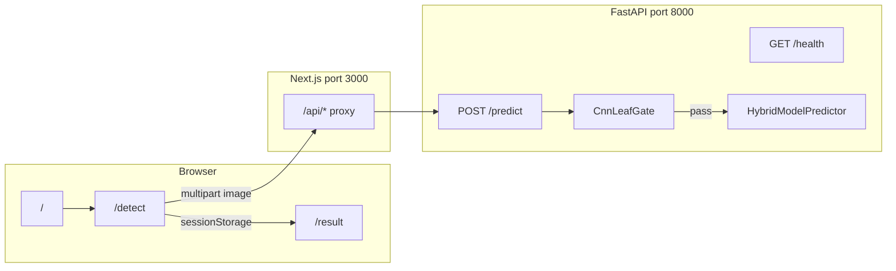
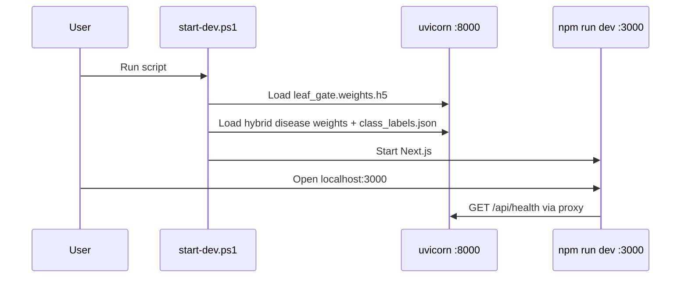
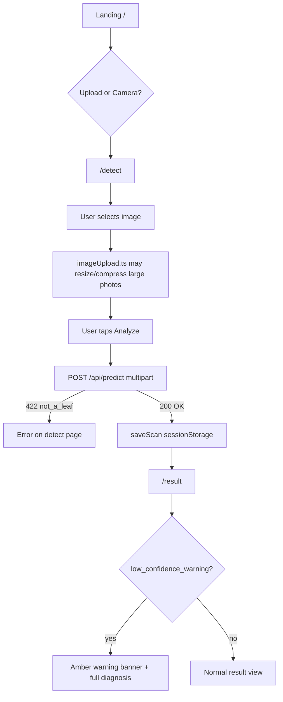
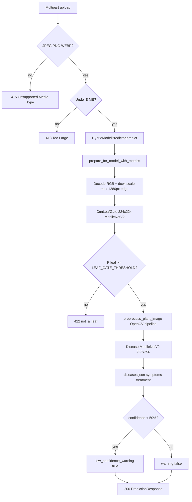

# LeafScan — full workflow

End-to-end flow from app startup through upload, CNN leaf gate, disease model, and result UI.

Supported crops at inference: **maize, potato, tomato** (22 disease classes from training).

---

## 1. System overview

| Layer | Role |
|-------|------|
| **Frontend** (`frontend/`) | UI, image pick/compress, API calls, stores last scan in `sessionStorage` |
| **Next.js proxy** (`frontend/next.config.mjs`) | Rewrites `/api/*` → `http://127.0.0.1:8000/*` so phones only need port 3000 |
| **Backend** (`backend/app/`) | CNN leaf gate + disease model + disease metadata |

---

## 2. Dev startup (your PC)

**Backend startup** (`backend/app/main.py` `lifespan`):

1. `build_leaf_gate()` — loads `CnnLeafGate` from `LEAF_GATE_MODEL_PATH` (required; API fails without file)
2. `build_predictor()` — loads MobileNetV2 **disease** student from `MODEL_PATH` + `class_labels.json`
3. Both models warmed up with a dummy tensor (first real request is fast)

**Health check:** `GET /health` → `{ status, predictor: "hybrid", model_loaded: true, leaf_gate: "model" }`

Quick start: see [README.md](../README.md#quick-start-local) or run `.\start-dev.ps1` from the repo root.

---

## 3. User journey (frontend)

| Step | File | What happens |
|------|------|----------------|
| Landing | `frontend/app/page.tsx` | Links to `/detect` (upload or camera mode) |
| Detect | `frontend/app/detect/page.tsx` | `predictImage(file)` **first**, then thumbnail preview; 90s timeout |
| API client | `frontend/lib/api.ts` | `getApiBase()` → same-origin `/api` on LAN; parses 422 `{ code, message }` |
| Result | `frontend/app/result/page.tsx` | Reads `scanStore`: label, confidence, symptoms, treatment, optional warning |

**Phone on Wi‑Fi:** open `http://<laptop-ip>:3000` — traffic hits the Next proxy, not port 8000 directly.

---

## 4. Backend: `POST /predict` pipeline

### Stage A — CNN leaf gate + scene veto (required)

- **File:** `backend/app/leaf_gate.py`
- **Input:** downscaled raw RGB (no white balance)
- **Step 1 — Scene veto:** fast reject for obvious non-leaves (heavy gray/road/sky, no green, skin tones)
- **Step 2 — CNN:** `P(leaf)`; pass if `score >= LEAF_GATE_THRESHOLD` (default **0.85**) and enough plant-like pixels
- **Fail:** `PredictorValidationError` → HTTP **422** `code: "not_a_leaf"` → detect page error banner

### Stage B — Disease preprocessing (unchanged from training)

- **File:** `backend/app/preprocessing.py` — `preprocess_plant_image`
- Gray-world WB → CLAHE → HSV leaf mask → lesion saliency → crop → resize **256×256**
- Produces float32 tensor `(1, 256, 256, 3)` for the disease model

### Stage C — Disease classification

- **Files:** `backend/app/predictor.py`, `backend/app/model.py`
- Softmax over 22 classes → argmax → `class_labels.json` key
- **Metadata:** `backend/app/diseases.py` + `diseases.json` → label, severity, symptoms, treatment

### Stage D — Low-confidence warning (does not block)

- If `confidence < LOW_CONFIDENCE_THRESHOLD` (default **0.50**):
  - `low_confidence_warning: true` and `warning_message` set
- User still sees full diagnosis on the result page (amber banner)

---

## 5. Decision matrix (what the user sees)

| Upload | CNN gate | Disease conf | HTTP | UI |
|--------|----------|--------------|------|-----|
| Car / sky / desk | Fail | — | 422 | Detect: **No leaf detected** |
| Real leaf | Pass | ≥ 50% | 200 | Result: normal |
| Real leaf | Pass | < 50% | 200 | Result: diagnosis + **low-confidence warning** |
| Bad file type | — | — | 415 | Error message |
| Corrupt bytes | — | — | 400 | Error message |

---

## 6. Key config (`backend/.env`)

| Variable | Purpose |
|----------|---------|
| `MODEL_PATH` | Disease model weights (required) |
| `CLASS_LABELS_PATH` | 22-class label order (required) |
| `LEAF_GATE_MODEL_PATH` | CNN leaf gate weights (required) |
| `LEAF_GATE_THRESHOLD` | Min P(leaf) to proceed (default 0.85) |
| `LOW_CONFIDENCE_THRESHOLD` | Disease warning only (default 0.50) |

Retrain leaf gate: `python scripts/train_leaf_gate.py --data-dir ...` from `backend/`.

---

## 7. Files map

| Concern | Location |
|---------|----------|
| Leaf gate CNN | `backend/app/leaf_gate.py`, `leaf_gate_model.py` |
| Disease model | `backend/app/predictor.py`, `model.py` |
| OpenCV prep | `backend/app/preprocessing.py` |
| API routes | `backend/app/main.py` |
| Train leaf gate | `backend/scripts/train_leaf_gate.py` |
| Detect UI | `frontend/app/detect/page.tsx` |
| Result UI | `frontend/app/result/page.tsx` |

---

This document describes how the system works today; it is not a build checklist.
